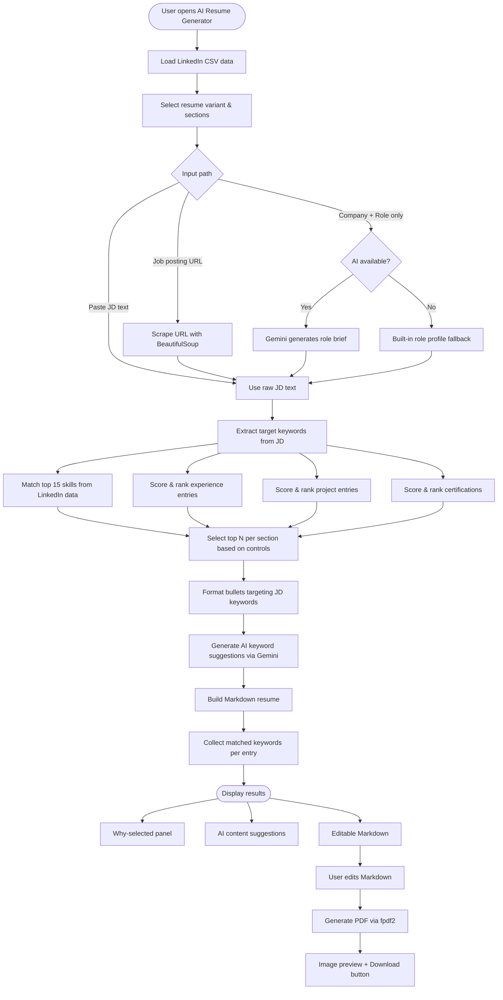
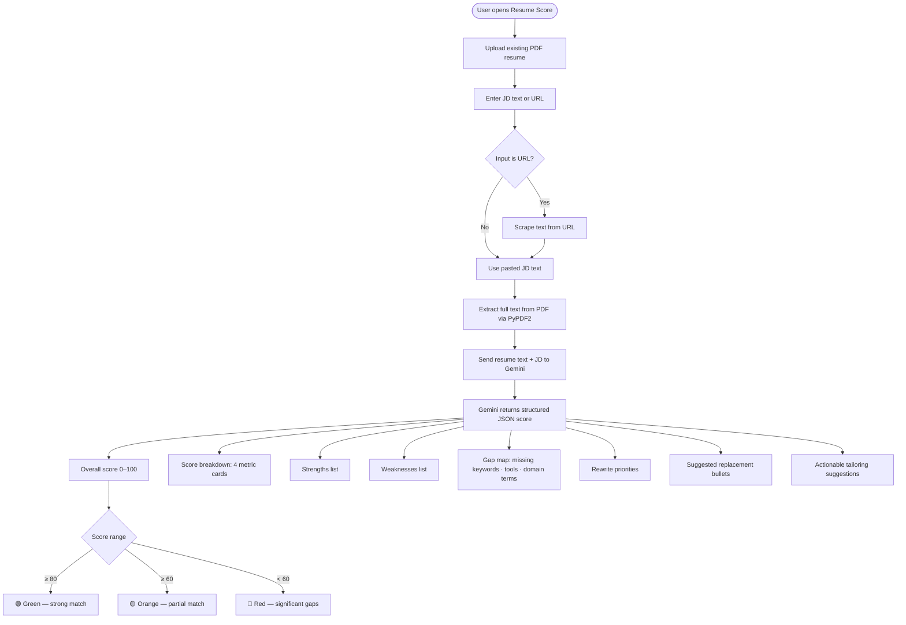
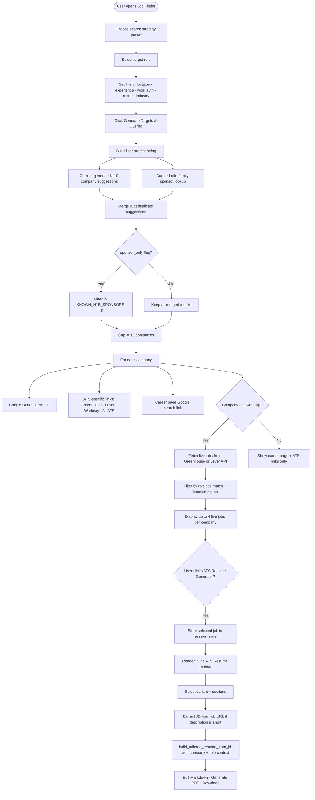

# 🚀 AI Career Suite — RESUME-GEN

An AI-powered career optimization tool built with **Streamlit** and **Google Gemini AI**. It helps job seekers create ATS-optimized resumes, score their resume against a job description, and discover targeted job opportunities — all from their LinkedIn data export.

---

## ✨ Features

| Tool | Description |
|---|---|
| 📄 **AI Resume Generator** | Tailors your resume to a job description or an inferred company-and-role target using LinkedIn export data, supports section toggles and resume variants, and outputs editable Markdown plus a downloadable PDF. |
| 📊 **Resume Score** | Analyzes how well your existing PDF resume matches a job description and now returns a score breakdown, gap map, rewrite priorities, and suggested replacement bullets. |
| 🔍 **Job Finder** | Identifies top hiring companies for your target role, adds structured filters for work authorization and job preferences, and generates Google Dork plus ATS-specific search links for company job boards. |

---

## 🛠️ Tech Stack

- **Python 3.11**
- **[Streamlit](https://streamlit.io/)** — Web UI
- **[Google Generative AI (Gemini)](https://ai.google.dev/)** — LLM for analysis and content generation
- **Pandas** — LinkedIn CSV data processing
- **fpdf2** — PDF generation
- **PyPDF2** — PDF text extraction
- **BeautifulSoup4 + Requests** — Job description extraction from URLs
- **python-dotenv** — Environment variable management

---

## 📋 Prerequisites

1. **Python 3.11** — [Download here](https://www.python.org/downloads/)
2. **Google Gemini API Key** — [Get one free at Google AI Studio](https://aistudio.google.com/app/apikey)
3. **LinkedIn Data Export** — Your personal LinkedIn data (CSV files)

---

## ⚡ Quick Start

### 1. Clone the Repository

```bash
git clone https://github.com/Unigalactix/RESUME-GEN.git
cd RESUME-GEN
```

### 2. Create a Virtual Environment (Recommended)

```bash
python3 -m venv venv
source venv/bin/activate       # macOS/Linux
venv\Scripts\activate          # Windows
```

### 3. Install Dependencies

```bash
pip install -r requirements.txt
```

### 4. Configure Your API Key

Copy the environment template and update it:

```bash
cp .env.example .env
```

Then set your API key in `.env`:

```bash
GEMINI_API_KEY=your_gemini_api_key_here
```

> ⚠️ **Never commit your `.env` file.** It is already listed in `.gitignore`.

### 5. Add Your LinkedIn Data

Export your LinkedIn data and place the CSV files in the `Data/` folder. See [LinkedIn Data Export Guide](#-linkedin-data-export-guide) below.

### 6. Run the App

```bash
streamlit run app.py
```

The application will open at **http://localhost:8501**.

---

## 🔑 Configuration

### Environment Variables

| Variable | Description |
|---|---|
| `GEMINI_API_KEY` | Your Google Gemini API key (required) |

When the API key is missing, the app now surfaces a visible warning and AI-assisted features fall back to limited behavior where possible.

### LinkedIn Data Export Guide

1. Go to **LinkedIn > Settings & Privacy > Data Privacy > Get a copy of your data**
2. Select **"Want something in particular? Select the data files you're most interested in"**
3. Check at minimum: **Profile, Positions, Education, Skills, Projects, Certifications**
4. Download the export (can take up to 24 hours)
5. Extract the ZIP and copy all CSV files into the `Data/` folder of this project

---

## 🖥️ Usage

---

### 📄 AI Resume Generator

Generates a fully tailored, ATS-optimized Markdown and PDF resume from your LinkedIn data export, targeted to a specific job description, URL, or a company-and-role brief you provide manually.

#### Step-by-step

1. Navigate to **AI Resume Generator** from the sidebar.
2. Choose a **resume variant** (e.g., Technical, Executive, Concise) and pick which **sections** to include. The order you pick sections becomes the final resume order.
3. **Choose one of three input paths** (see below):
   - Paste a full **job description** text.
   - Enter a **job posting URL** — the app will scrape and extract the description automatically.
   - Leave the JD blank and use the **Company + Role** inputs instead — the app will generate a compact target brief using AI or a deterministic role profile.
4. Optionally expand **"Targeting controls"** to choose how many entries to include per section (Top 2 or Top 3 for experience, projects, and certifications).
5. Click **Generate Tailored Resume**.
6. Review the output — read the **"Why these items were selected"** panel to see which keywords drove each selection.
7. Edit the **Markdown** directly in the text area if you want to adjust wording.
8. Click **Generate Final PDF** and download your resume.

#### Input path details

| Path | When to use | What happens internally |
|---|---|---|
| **JD text** | You have the full job description text | Keywords extracted directly from the pasted text |
| **Job posting URL** | You have a link to the live posting | App scrapes the page with BeautifulSoup and extracts visible text |
| **Company + Role** | No JD available (e.g., direct outreach, referral) | AI (Gemini) generates a role brief, or falls back to a built-in role profile dictionary |

#### Resume variant options

Each variant controls the section order and the number of bullets per experience and project entry. Select the variant that matches the role type:

| Variant | Best for |
|---|---|
| **Technical** | Software, Data, ML, Cloud engineering roles |
| **Executive** | Senior, Staff, or Director-level positions |
| **Concise** | Strict 1-page or ATS-first applications |

#### Targeting controls

Visible under the **"⚙️ Adjust how many entries to include per section"** expander:

| Control | Options | Default |
|---|---|---|
| Max experience entries | Top 2 / Top 3 | 3 |
| Max project entries | Top 2 / Top 3 | 3 |
| Max certifications | Top 2 / Top 3 | 3 |

Items are ranked locally using a keyword overlap score — no extra LLM calls. The **"🔍 Why these items were selected"** expander after generation shows the matched keywords for each chosen entry.

#### Workflow diagram



#### Output panel reference

| Panel | What it shows |
|---|---|
| **Inferred target brief** | The AI-generated or deterministic brief used when no JD was provided |
| **Selection summary** | Caption showing how many entries were selected per section |
| **🔍 Why these items were selected** | Per-entry list of matched JD keywords that caused that entry to be ranked |
| **💡 AI Content Suggestions** | Keyword-rich bullet ideas generated by Gemini — add these if any apply to you |
| **Resume Content (editable)** | Full Markdown output you can change before generating the PDF |

---

### 📊 Resume Score & Analysis

Analyzes your existing PDF resume against a job description and returns a full ATS-compatibility report with a numeric score, gap map, and ready-to-use rewrite suggestions.

#### Step-by-step

1. Navigate to **Resume Score** from the sidebar.
2. Upload your resume as a **PDF** using the file uploader.
3. Paste a job description **text** or enter a job posting **URL** in the JD field.
4. Click **Score My Resume**.
5. Review your overall score, the four-category breakdown, gap map, rewrite priorities, and suggested replacement bullets.

#### How scoring works

The entire analysis is performed by Gemini in a single structured call. The model evaluates four dimensions and returns a JSON object:

| Dimension | What it measures |
|---|---|
| **Keyword Match** | Overlap of JD keywords with resume text |
| **Technical Alignment** | Matching tools, languages, frameworks, and domain terms |
| **Impact Strength** | Presence of quantified, action-verb-led bullet points |
| **Experience Alignment** | Seniority and industry relevance of your background |

The composite score drives the color indicator: 🟢 ≥ 80 · 🟡 ≥ 60 · 🔴 < 60.

#### Workflow diagram



#### Output reference

| Section | Description |
|---|---|
| **Score** | Single 0–100 integer shown in large colored text |
| **Score Breakdown** | Four metric cards: Keyword Match, Technical Alignment, Impact Strength, Experience Alignment |
| **Key Strengths** | Things your resume already does well for this JD |
| **Areas for Improvement** | Specific weaknesses Gemini identified |
| **Missing Keywords** | JD terms absent from your resume |
| **Missing Tools** | Technologies listed in the JD that do not appear in your resume |
| **Missing Domain Terms** | Industry / domain vocabulary gaps |
| **Rewrite Priorities** | Ordered list of bullets or sections to change first |
| **Suggested Resume Bullets** | Ready-to-paste rewrites aligned to the JD |
| **Actionable Suggestions** | Broader advice for tailoring the resume to this specific role |

> **Tip:** Copy the suggested bullets directly into the **AI Resume Generator's** editable Markdown area for a combined workflow — score first, then regenerate with improvements.

---

### 🔍 Job Finder & Company Targeter

Identifies realistic target companies for your job search, generates Google Dork and ATS-specific search links per company, fetches live job postings from Greenhouse and Lever APIs where available, and offers an inline ATS Resume Builder triggered directly from a job listing.

#### Step-by-step

1. Navigate to **Find Jobs** from the sidebar.
2. Choose a **search strategy preset** or start with **Custom**.
3. Select your **target role** from the dropdown or type a custom one.
4. Fill in **filters** — location, experience level, job mode, industry focus, company stage, and work authorization focus.
5. Toggle **"Only show known H-1B sponsoring companies"** if required.
6. Click **Generate Targets & Queries**.
7. Browse the company cards — each shows reason, sponsorship signal, visa note, Google and ATS search links, and a career page link.
8. If live jobs are found for a company (via Greenhouse or Lever API), click **Apply Now** or **ATS Resume Generator** directly on a listing.
9. In the inline resume builder, select a variant and sections, then click **Generate ATS Resume for Selected Job** to produce a tailored resume and download it as a PDF.

#### Search strategy presets

| Preset | Experience level | Work auth focus | Sponsor filter |
|---|---|---|---|
| **Custom** | Any | General search | Off by default |
| **F-1 OPT New Grad** | New Grad | F-1 OPT friendly | Off |
| **STEM OPT Early Career** | Entry Level | STEM OPT friendly | Off |
| **H-1B Transfer** | Mid Level | H-1B sponsorship required | On |
| **Cap-Exempt Research** | Any | Cap-exempt H-1B only | On |

#### Company suggestion logic

Suggestions are built from two sources and merged:

1. **AI suggestions** — Gemini recommends 6–10 companies based on your full filter set (role, location, experience level, work auth focus, industry, company stage).
2. **Curated sponsors** — A hardcoded role-family lookup (`ROLE_FAMILY_SPONSORS`) returns known sponsors for your role type (software, data, ML, cloud, security, product, business).

Merging applies these rules in order:
- Duplicates removed by normalized company name.
- When `sponsor_only = True`, companies not in `KNOWN_H1B_SPONSORS` are filtered out.
- When `sponsor_only = True`, curated sponsors are prepended before AI suggestions to surface the most reliable targets first.
- Result capped at 10 companies.

#### Live job fetching

For companies with known API slugs, the app fetches live postings directly:

| ATS Platform | Companies supported |
|---|---|
| **Greenhouse API** | Databricks, Snowflake, DoorDash, Wayfair |
| **Lever API** | NVIDIA, Databricks |

Fetched jobs are filtered by role title word-match and, when `strict_location` is on, by location substring match. Up to 4 matching jobs are shown per company.

#### Workflow diagram



#### Work authorization keyword injection

When a work auth focus is selected, the Google Dork queries automatically include relevant search terms:

| Work auth focus | Added search terms |
|---|---|
| **F-1 OPT friendly** | `OPT`, `F-1`, `international students`, `sponsorship` |
| **STEM OPT friendly** | `OPT`, `STEM OPT`, `F-1`, `sponsorship` |
| **H-1B sponsorship required** | `H1B`, `H-1B`, `sponsorship`, `sponsor`, `work authorization` |
| **Cap-exempt H-1B only** | `cap exempt`, `cap-exempt`, `university`, `nonprofit`, `research` |

#### ATS search link types

Each company card generates four types of links to help you find roles directly on hiring platforms:

| Link type | What it searches |
|---|---|
| **All ATS** | Lever + Greenhouse + Workday + iCIMS combined |
| **Greenhouse** | `site:greenhouse.io` only |
| **Lever** | `site:lever.co` only |
| **Workday** | `site:workday.com OR site:myworkdayjobs.com` only |

---

### App Validation

The sidebar shows whether:

1. Gemini is configured correctly.
2. Your required LinkedIn export files are present.
3. The app is running in fallback mode because of missing configuration.

---

## 📁 Project Structure

```
RESUME-GEN/
├── app.py                  # Streamlit entry point — navigation & routing
├── data_loader.py          # Loads & parses LinkedIn CSV exports
├── matcher.py              # AI-powered skill & experience matching
├── markdown_generator.py   # Converts structured data to Markdown resume
├── pdf_generator.py        # Renders Markdown resume to PDF (fpdf2)
├── resume_formatter.py     # ATS formatting rules & helpers
├── requirements.txt        # Python dependencies
├── .env                    # API keys — NOT committed (add manually)
├── .gitignore
├── .devcontainer/
│   └── devcontainer.json   # VS Code Dev Container configuration
├── Data/                   # LinkedIn CSV exports & processed JSON data
│   ├── Process_data.py     # Data processing utilities
│   ├── update_data_json.py # Updates JSON cache from CSVs
│   ├── positions.json      # Cached positions data
│   ├── certs.json          # Cached certifications data
│   └── *.csv               # LinkedIn data export files
└── tools/                  # Feature modules (Streamlit page renderers)
    ├── __init__.py
    ├── resume_generator.py # AI Resume Generator page
    ├── resume_scorer.py    # Resume Score page
    └── job_finder.py       # Job Finder page
```

---

## 🧑‍💻 Development with VS Code Dev Containers

This repository includes a `.devcontainer` configuration for one-click setup with VS Code:

1. Install the **Dev Containers** extension in VS Code
2. Open the project folder in VS Code
3. Click **"Reopen in Container"** when prompted
4. The container will install all dependencies and automatically start the Streamlit app on port **8501**

---

## 🤝 Contributing

Contributions are welcome! To get started:

1. Fork the repository
2. Create a new branch: `git checkout -b feature/your-feature-name`
3. Make your changes and commit: `git commit -m "Add your feature"`
4. Push to your fork: `git push origin feature/your-feature-name`
5. Open a Pull Request

---

## 📄 License

This project is open source. See the repository for licensing details.
